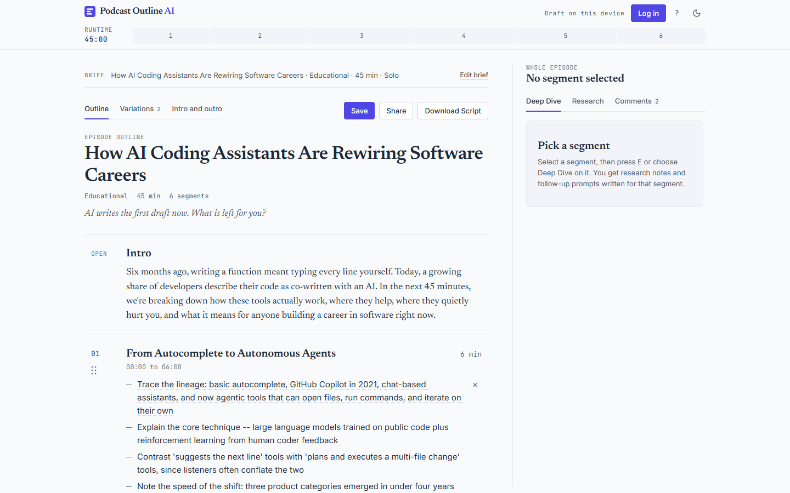
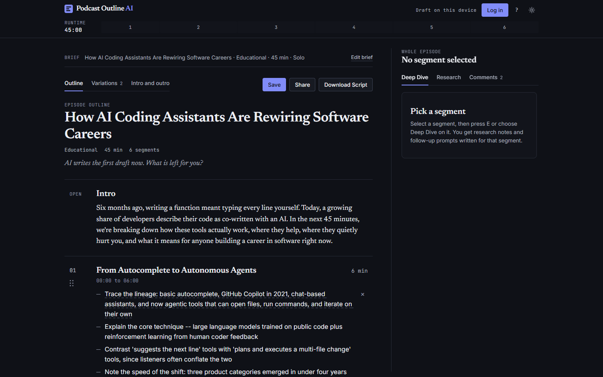
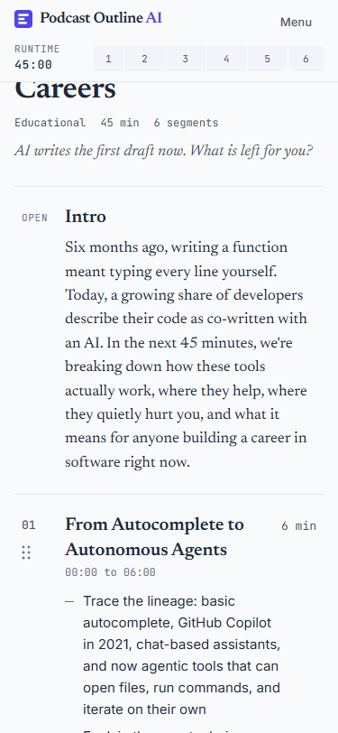
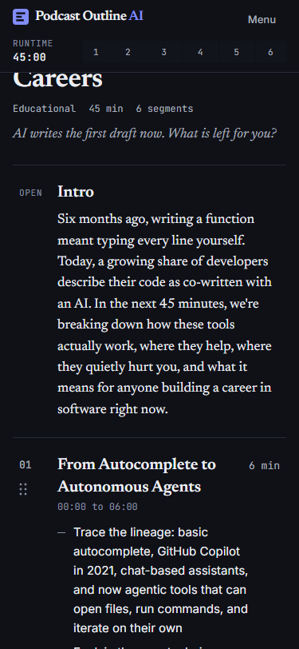
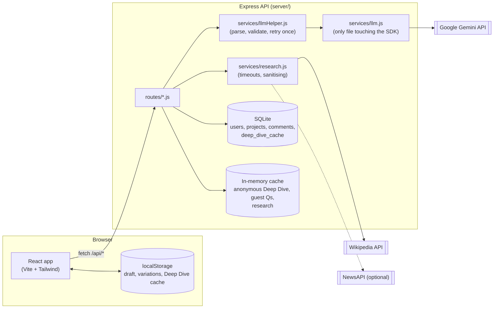

# Podcast Outline AI

Plan a podcast episode as a document you can edit like a script: a timed outline with talking points and transitions, alternative structures to compare, suggested sources, hooks and outros, and comments from collaborators. Export it as Markdown, plain text or a print-ready production script.



| | |
|---|---|
|  |   |

The landing page: [light](docs/screenshots/landing-light-desktop.png) · [dark](docs/screenshots/landing-dark-desktop.png) · [phone](docs/screenshots/landing-light-mobile.png)

Generation states: [generating](docs/screenshots/generating-light-desktop.png) · [inline error](docs/screenshots/generation-error-light-desktop.png) · [empty My episodes](docs/screenshots/my-episodes-empty-light-desktop.png)

More screens: [variations](docs/screenshots/variations-light-desktop.png) · [research](docs/screenshots/research-light-desktop.png) · [comments](docs/screenshots/comments-dark-desktop.png) · [intro and outro](docs/screenshots/intro-outro-light-desktop.png) · [the brief](docs/screenshots/brief-light-desktop.png) · [print view](docs/screenshots/print-view.png)

`REQUIREMENTS.md` maps each feature to the files that implement it and how to verify it. `DESIGN.md` documents the design system.

## What it does

A user describes an episode (topic, tone, length, hosts, optional guest). The server calls Google Gemini to produce a structured outline: an intro, 5 to 8 segments (title, 3 to 5 talking points, duration, transition), guest questions, and an outro. The client renders it as a timeline and an editable document.

- **Brief and outline.** Topic, five preset tones or a custom one, podcast name, host count, length, optional guest. Server-side schema validation with one automatic retry; durations always sum exactly to the requested length.
- **Generation feedback.** While an outline is written, the New Episode screen shows a progress card (estimated bar, four steps, outline skeleton). If generation fails, an inline error explains why and offers **Retry Generation** or **Back to Edit Settings**. **My episodes** has its own empty state with **Create Your First Episode**.
- **Editing.** Click any text to edit it (Enter saves, Escape discards). Drag segments to reorder, or use the keyboard. Durations, the timeline and the running clock update live. Removals offer Undo.
- **Multiple outline variations.** Ask for 2 or 3 structures in one request (for example chronological story, problem and solution, myth-busting). Compare them side by side, use one as the working outline, or copy single segments across (add or replace) with durations re-normalized.
- **Research and source suggestions.** Wikipedia results for a segment or the whole topic (no key needed), and optional recent news through NewsAPI. Pin sources to a segment and include them in the export as a "Sources" section.
- **Intro, hook and outro generator.** Five opening hooks (question, bold claim, story, statistic, cold open), a full intro script, three outros with a call to action, and a teaser line, in one request. Duo and group scripts mark speaker turns. Choose a hook or outro and it becomes the outline's intro or outro.
- **Deep Dive.** Per-segment research notes and follow-up prompts, from a second call that receives the whole outline. Cached per segment and marked stale, never silently rewritten, when the segment changes.
- **Guest Questions.** Generated, editable, regenerable.
- **Comments.** Comment on the episode or a segment. Owners share a read-only link and choose whether signed-in visitors may comment. Owners can resolve or delete any comment; everyone can delete their own.
- **Download Script.** Markdown, plain text, or a print view laid out as a production script with a timing column.
- **Accounts (optional).** Email and password, saved projects, share links. Everything except saving and comments works with no login, using `localStorage`.
- **Demo mode.** Three bundled outlines, each with sample variations, sources, hooks and comments, so every feature can be shown with no API key and no network.

## Keyboard shortcuts

`/` edit the brief · `J` / `K` next or previous segment · `E` Deep Dive · `R` Research · `C` Comments · `Ctrl/Cmd+S` save · `?` list shortcuts · `Esc` close. Single-key shortcuts are off while typing in a field.

## Routes

| Path | Page | Notes |
|---|---|---|
| `/` | Landing page | Features, how it works, a sample outline. Signed-out visitors see Log in and Sign up (each opens the auth dialog) and **Get started**; signed-in visitors see **Open app** and Log out. |
| `/app` | Workspace | The editor. Works with no account; the draft is kept in `localStorage` across refreshes. |
| `/shared/:token` | Shared outline | Read-only view of a share link. Signed-in visitors can comment if the owner allows it. |
| anything else | | Redirects to `/`. |

How the routes and the session fit together:

- **Try a demo** on the landing page goes to `/app` with the bundled demo loaded. The hand-off uses router state that is cleared straight away, so refreshing `/app` keeps your edits instead of reloading the demo.
- **Logging in or signing up** from the landing page goes to `/app`. From inside `/app` it stays put.
- **Logging out** removes the draft from `localStorage`, resets the workspace (outline, Deep Dives, guest questions, open project, share state), closes any open dialog or panel, and goes to `/` with `replace`, so Back does not return to the old outline. It does this even if the server cannot be reached. The theme and export preferences are settings, not user data, and are kept.
- **An expired session** is detected when `/api/auth/me` answers 401 *and* this browser had a signed-in session (a small marker key, `podcast-session`, records that). Anonymous visitors get the same 401, so on its own it never clears a draft. An expiry clears the draft, shows a message and, from `/app`, returns to `/`.
- **Several tabs stay in step** through the browser's `storage` event: signing out in one tab resets the others and sends them to `/`; signing in refreshes them.
- **A slow first `/me` answer** is ignored if the user logged in or out while it was in flight, so a stale 401 cannot sign someone out right after they log in.

## Architecture



All LLM calls go through `generate()` in `server/services/llm.js`, wrapped by `llmHelper.js`. Every external HTTP call (Wikipedia, NewsAPI) is made by the server, never the browser.

## Setup

Requires Node 18.18 or newer.

```bash
git clone <this-repo> && cd <this-repo>
npm install
cp .env.example server/.env      # then edit server/.env: JWT_SECRET, and GEMINI_API_KEY if you have one
npm run dev
```

Open http://localhost:5173 for the landing page, or http://localhost:5173/app for the editor. Without a `GEMINI_API_KEY`, choose **Try a demo** on the landing page, or one of the demo outlines under the brief; the whole interface works from those.

The repository folder may be named `ai-podcast-scirpt-generator` (a typo in the original name). It can be renamed at any time; nothing in the code depends on the folder name. The app, packages and page title are all "Podcast Outline AI".

| Command | What it does |
|---|---|
| `npm run dev` | API on :8787 and client on :5173 |
| `npm test` | Server and client test suites |
| `npm run lint` | ESLint over the client (`.js` and `.jsx`) |
| `npm run build` | Production client build |
| `npm run check:contrast` | WCAG AA check of every color pair in both themes |
| `npm run screenshots` | Regenerates `docs/screenshots/` (needs the dev servers and Chrome or Edge) |
| `npm run samples` | Regenerates `sample-output/` from the demo data |

If the dev server fails with "port already in use", another copy is still running. Stop it, or set `PORT` in `server/.env`. After changing `tailwind.config.js`, restart the dev server; Vite does not reload it.

## Environment variables

Set these in `server/.env` (copied from `.env.example`).

| Variable | Required | Default | Notes |
|---|---|---|---|
| `GEMINI_API_KEY` | No | *(empty)* | Get one at https://aistudio.google.com/apikey. Without it, live generation returns a clear error and the UI offers the demos. |
| `NEWS_API_KEY` | No | *(empty)* | Enables the "Recent news" section in the Research panel. Free NewsAPI keys only answer requests from localhost and have a small daily limit, so this is a local-development extra. With no key the news section is hidden and nothing else changes. Get one at https://newsapi.org. |
| `PORT` | No | `8787` | Express listen port. |
| `DATABASE_PATH` | No | `./data/podcast.sqlite` | Relative paths resolve from `server/`. See "Known limitations" for ephemeral-disk hosts. |
| `JWT_SECRET` | Yes (production) | insecure dev default | Generate with `openssl rand -hex 32`. |
| `CORS_ORIGIN` | No | `http://localhost:5173` | Comma-separated origins allowed to call the API with credentials. |
| `NODE_ENV` | No | `development` | Set to `production` when deployed: cookies become `Secure; SameSite=None` for a split frontend and backend. |
| `GEMINI_MODEL` | No | `gemini-3.6-flash` | Override if Google renames or retires the model. `gemini-2.5-flash` is no longer served to new API keys. |

Client build-time variables: `VITE_API_BASE_URL` is the deployed API's origin (leave unset for local development; Vite proxies `/api`). `API_TARGET` overrides the dev proxy target if the API is not on `localhost:8787`.

## Database schema

SQLite through `better-sqlite3`. `server/db/schema.sql` is the baseline; later changes are versioned migrations in `server/db/migrations.js`, tracked with SQLite's `PRAGMA user_version`. Each runs once, inside a transaction, on server start, so a database from an older release upgrades in place without losing data.

```
users            (id, email UNIQUE, password_hash, created_at)
projects         (id, user_id -> users.id, title, outline_json, share_token UNIQUE,
                  comments_enabled DEFAULT 1, created_at, updated_at)
deep_dive_cache  (project_id -> projects.id, segment_id, content, is_stale, updated_at)
                 PRIMARY KEY (project_id, segment_id)
comments         (id, project_id -> projects.id ON DELETE CASCADE, segment_id NULL = whole episode,
                  author_user_id -> users.id, body, created_at, resolved DEFAULT 0)
                 INDEX (project_id, segment_id)
```

Migration 1 adds `projects.comments_enabled` (existing share links keep comments on) and the `comments` table. `outline_json` holds the whole outline as one document, including the optional fields below.

### Outline JSON

```json
{
  "episode_title": "string",
  "tone": "string",
  "total_duration_mins": 30,
  "intro": "string",
  "segments": [
    {
      "id": 1, "title": "string", "talking_points": ["3 to 5 strings"], "duration_mins": 6, "transition": "string",
      "sources": [{ "type": "wikipedia", "title": "string", "url": "https://...", "summary": "string" }]
    }
  ],
  "guest_questions": ["string"],
  "outro": "string",

  "variations": [{ "approach": "Myth-busting", "rationale": "string", "outline": { "...a complete outline without its own variations..." } }],
  "intro_outro": { "hooks": [{ "style": "Question", "text": "string" }], "intro_script": "string", "outros": ["string"], "teaser": "string" }
}
```

`segments[].sources`, `variations` and `intro_outro` are optional. An outline saved before they existed loads and saves unchanged (covered by a test). At most 3 variations and 10 pinned sources per segment.

## API reference

Failures use one shape: `{ "error": "message", "code": "MACHINE_CODE", "details"?: [...] }`. Auth is an httpOnly session cookie, so examples assume a cookie jar.

### Auth

`POST /api/auth/signup` and `POST /api/auth/login` take `{ email, password }` and return `{ user }`. `POST /api/auth/logout` returns 204. `GET /api/auth/me` returns `{ user }` or 401.

### Generation

| Route | Body | Response |
|---|---|---|
| `POST /api/generate-outline` | `{ topic, tone, podcastName?, hostCount, lengthMins, includeGuests?, guestNames?, guestBio? }` | `201 { outline }` |
| `POST /api/generate-variations` | same as above, plus `count` (2 or 3) | `201 { variations: [{ approach, rationale, outline }], skipped }` |
| `POST /api/intro-outro` | `{ topic, tone, hostCount?, podcastName?, lengthMins, outline }` | `{ introOutro: { hooks, intro_script, outros, teaser } }` |
| `POST /api/expand-segment` | `{ topic, tone, lengthMins, outline, segment, projectId? }` | `{ deepDive: { notes, discussion_prompts }, cached }` |
| `POST /api/guest-questions` | `{ topic, tone, guestNames?, guestBio?, outline }` | `{ questions, cached }` |

`generate-variations` returns every variation that validates. If some still fail after the retry, the valid ones are returned and `skipped` says how many were left out; if none validate the response is `502 LLM_INVALID_RESPONSE`. Durations in each variation are normalized to `lengthMins`. `intro-outro` requires exactly five hooks (one per style), three outros, and, for `duo` and `group`, `Host 1:` and `Host 2:` turn labels; a solo intro must have none.

Other errors: `400 VALIDATION_ERROR`, `503 LLM_NOT_CONFIGURED`, `502 LLM_INVALID_RESPONSE`, `429 RATE_LIMITED`.

### Research

`GET /api/research?topic=...&segmentTitle=...`

```json
{
  "wikipedia": { "results": [{ "type": "wikipedia", "title": "...", "summary": "...", "url": "https://en.wikipedia.org/wiki/..." }], "error": null },
  "news": { "enabled": false, "results": [], "error": null },
  "disclaimer": "Suggested sources: verify before citing.",
  "cached": false
}
```

Every item comes from an API response; no LLM is involved. Titles and summaries are stripped of markup and truncated, Wikipedia URLs are built from the title, and news URLs must be `http(s)`. Calls time out after 6 seconds. A failing provider reports its own `error` and the other still returns. Successful lookups are cached for an hour; failures are not. Limited to 20 requests per minute per IP.

### Projects and sharing (login required)

`GET|POST /api/projects`, `GET|PUT|DELETE /api/projects/:id`. Bodies are `{ title, outline }`. A project you don't own returns `404`, not `403`. Responses include `commentsEnabled`.

`POST /api/projects/:id/share` creates a link (`{ shareToken }`). `PATCH /api/projects/:id/share` with `{ commentsEnabled: boolean }` turns comments on or off for that link. `DELETE /api/projects/:id/share` revokes it.

`GET /api/shared/:token` needs no login and returns `{ title, outline, updatedAt, commentsEnabled, viewerIsOwner }`.

### Comments

The same handlers serve two entry points: `/api/projects/:id/comments` for the owner, and `/api/shared/:token/comments` for anyone signed in who holds a valid link.

| Route | Who | Notes |
|---|---|---|
| `GET .../comments` | owner; signed-in link holders | `{ comments: [{ id, segmentId, body, createdAt, resolved, author: { name }, isMine }] }`. `name` is the email prefix; emails are never returned. |
| `POST .../comments` | same | `{ body, segmentId? }`. `body` is 1 to 1000 characters; `segmentId` must be `null` (whole episode) or a segment of the outline. 15 per minute per IP. |
| `PATCH .../comments/:commentId` | owner only | `{ resolved: boolean }` |
| `DELETE .../comments/:commentId` | owner (any comment), author (their own) | 204 |

Status codes: `401` when signed out, `404` for an unknown project, link or comment (and for another user's project), `403 FORBIDDEN` when acting outside your role, `403 COMMENTS_DISABLED` when the owner has switched comments off for the link. The owner's own routes keep working when the link's comments are off. The client polls every 30 seconds while the panel is open and again whenever it is opened; there are no websockets.

## Prompt design

Every call restates the topic, tone (with a one-line style note) and target length through one helper, `buildContextBlock` in `server/prompts/outlinePrompt.js`, which is the main defense against tone drift across calls. Deep Dive and the intro/outro prompt also receive the outline, so they don't repeat what other segments cover.

All calls use Gemini's JSON mode with a response schema (`server/prompts/schemas.js`), then `llmHelper.js` strips code fences, parses, and validates against rules a JSON schema can't express (segment and point counts, hook styles, speaker labels). On failure it retries once with the specific errors appended, then gives up with `502`. A validator may also return a `salvage` subset, which is how variations return the valid ones. The variations prompt asks for different structures and the server rejects a repeated approach label, so "different" is enforced, not hoped for. The statistic hook may not invent a number: the prompt asks for a `[verify: ...]` placeholder when unsure.

## Testing and verification

`npm test` runs 234 tests: 128 on the server and 106 on the client. All pass. `npm run lint` (ESLint, zero warnings allowed) and `npm run build` are clean.

**Server** (Vitest, Supertest, an in-memory SQLite database per test, LLM and `fetch` mocked): outline generation, validation and retry; variations (validator, partial-failure salvage, duplicate approaches, count limits); intro and outro (schema, speaker labels, retry); the research proxy (Wikipedia mapping, fallback query, empty results, upstream failure, caching, news on and off, key sent as a header); comment permissions for owner, commenter, outsider and comments-disabled; input limits and SQL metacharacters; schema migrations (upgrade from a version-0 database with data, idempotence, cascade); project persistence of the optional fields; auth, ownership and share tokens.

**Client** (Vitest): pure logic in Node (duration normalization, the running clock, blending, the workspace reducer, export formatting, relative time), and component tests in jsdom with Testing Library (`logout.test.jsx`, `landing.test.jsx`, `generation.test.jsx`). `generation.test.jsx` covers the progress card (title, bar, four steps in order, advancing over time, never reaching 100% early), the inline error (each known failure, Retry Generation re-sending the request, Back to Edit Settings, focus, no toast), and the My episodes empty state with and without saved episodes. The component tests mount the real providers and routes against a fake API and cover: logging out after generating an outline leaves the state, `localStorage` and route (`/`) empty, and replaces the history entry; logout with the server unreachable; an expired session clearing the draft while an anonymous 401 keeps it; a slow `/me` answer not undoing a login; sign-in and sign-out in another tab; the landing page for signed-out and signed-in visitors, its landmarks, headings and demo hand-off; and unknown URLs redirecting to `/`.

**Also run by hand against the running app** (Chrome driven by Playwright, `scripts/screenshots.mjs` and ad-hoc scripts): 37 checks on inline editing, keyboard reorder, undo, shortcuts, local comments, pinning and export with and without sources, using and blending variations, choosing hooks and outros, save prompts, and the phone sheet (focus in, Escape, focus back, no horizontal scroll); , a 18-check logout flow (draft survives a refresh, log out from `/app`, storage cleared, Back does not show the old outline, a second tab is sent to `/`, the next visit is an empty brief), and a 20-check two-user flow (owner saves and shares, visitor signs up and comments, owner resolves, comments switched off, sharing stopped). That an email address is never returned in comment data is asserted by a server test, not by the browser run. These scripts are not part of the repository.

**Live model.** The variations and intro/outro prompts were each run once against the real Gemini API (variations: two distinct structures with durations summing to 30; intro/outro for a duo: five hooks in five styles, `Host 1:` and `Host 2:` turns, three outros, a teaser).

**Not verified.** No screen reader (NVDA, VoiceOver) was used; keyboard paths, landmarks, labels and live regions are in place and were checked in a browser only. NewsAPI was tested with a mocked `fetch`, not a real key. The print layout was reviewed as rendered HTML in a browser. A PDF was generated from it, but its page breaks were not inspected page by page and it was not printed on paper; the rule that keeps a segment together on one page is set in CSS and asserted in a test, not observed across pages.

## Known limitations

- **SQLite persistence.** On hosts with an ephemeral filesystem, `server/data/podcast.sqlite`, with every account, project and comment, is lost on restart. Use a persistent volume (see Deployment).
- **In-memory caches.** Anonymous Deep Dive, guest-question and research results live in the Node process and reset on restart or across instances.
- **Per-process rate limiting.** `express-rate-limit` uses its in-memory store, so limits are per instance unless you add a shared store. The strict login limiter (10 per 15 minutes per IP) covers only login and signup; `/me` and logout use the general limit.
- **No email verification or password reset.**
- **Session marker.** Knowing that "this browser was signed in" lives in `localStorage`, so clearing site data by hand also forgets it; after that a truly expired session looks like an anonymous visit and the stale draft is kept. If the logout request cannot reach the server, this device still forgets the user, but the session cookie remains until it expires.
- **Comments.** The thread is visible to the owner and to every signed-in visitor holding the link, not only to each author. Comments cannot be edited, only deleted. There are no notifications; new comments appear when the panel is opened or on the next 30-second poll. Comments on a segment that is later removed stay in the database and show under "All" as "Removed segment". Demo comments live in the browser only.
- **Research.** Search text comes from the segment title and topic, with no LLM keyword step. Wikipedia is English only. NewsAPI's free tier works only from localhost and is limited daily.
- **Intro and outro.** "Regenerate all" rewrites the whole set (hooks, script, outros, teaser) in one request; single items cannot be regenerated individually.
- **Variations.** Three are kept at most. Using one replaces the title, intro, segments, guest questions and outro of the working outline (with Undo); the stored alternatives and the intro/outro set are kept. A replaced segment gets a new id, so its old Deep Dive does not carry over.
- **Progress steps are estimates.** Generation is one API request with no stage reporting, so the four steps in the progress card advance on a timer and the bar levels off below 100% until the response arrives. They do not reflect what the model is actually doing.
- **Free-tier model limits.** Variations and intro/outro use one request each on purpose. The LLM endpoints share a limit of 12 requests per minute per IP.
- **Model pinning.** `GEMINI_MODEL` defaults to `gemini-3.6-flash`. If Google retires it, set the variable; no code change is needed unless the SDK's call shape changes.
- **Accessibility** has not been audited with assistive technology (see "Not verified").

## Deployment

A typical split deployment: static client on Vercel, API on Railway or Render.

1. **API.** Deploy `server/` as a Node service (`npm install && npm start`, working directory `server`). Set `GEMINI_API_KEY`, `JWT_SECRET`, `NODE_ENV=production` and `CORS_ORIGIN=https://your-frontend-domain`. Attach a persistent volume and point `DATABASE_PATH` inside it. Optionally set `NEWS_API_KEY` (see the note above about free-tier limits).
2. **Client.** Deploy `client/` (`npm install && npm run build`, output `dist/`). Set `VITE_API_BASE_URL` to the API's origin. The app uses client-side routes (`/app`, `/shared/:token`), so the host must serve `index.html` for any path or a refresh on those URLs returns a 404. `client/vercel.json` does this for Vercel (`{ "rewrites": [{ "source": "/(.*)", "destination": "/index.html" }] }`; real files such as `/assets/*` are still served first). On Netlify use a `_redirects` file containing `/* /index.html 200`; on Nginx, `try_files $uri /index.html;`. `npm run dev` and `vite preview` already fall back to `index.html`.
3. **Cookies and CORS.** With the client and API on different domains, the session cookie must be `Secure; SameSite=None`, which the server does when `NODE_ENV=production`, and CORS must list the exact client origin with credentials. If login appears to succeed but `/api/auth/me` never sees the cookie, check both variables.
4. Run `npm run build` locally first to catch build problems before deploying.

## Why not just use a chat assistant?

You can paste a brief into a general chat assistant and get an outline. This app adds a schema that is enforced every time, a document built for editing that structure, timings that stay consistent as you edit, alternatives you can compare and blend, sources that come from real APIs, hooks and outros that respect your host setup, collaborators who can comment on a specific segment, and exports ready to record from.
