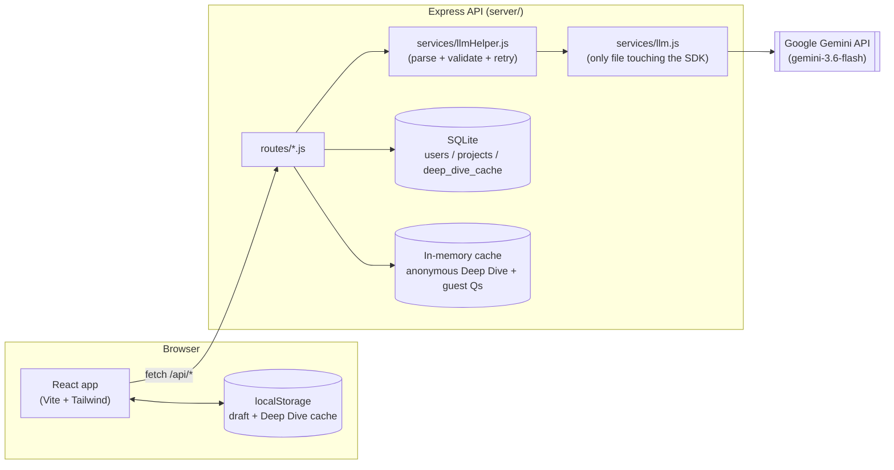

# Podcast Outline AI

Generate a complete, ready-to-record podcast episode outline -- segments, talking points, timing cues, and guest questions -- in under a minute, then edit it inline and export a script. Built from a hackathon-style problem brief; see `REQUIREMENTS.md` for a full feature-to-code trace and how each piece was verified.

## Overview

A user describes an episode (topic, tone, length, optional guest), and the backend calls Google Gemini once to produce a structured JSON outline: an intro, 5-8 segments (each with a title, 3-5 talking points, a duration, and a transition line), guest interview questions, and an outro. The frontend renders that as editable cards with a proportional timeline bar, lets the user "Deep Dive" into any segment for AI research notes (a second, cached Gemini call that's given the full outline for context so it doesn't drift or repeat), and exports the final script as Markdown, plain text, or a print-to-PDF page. Everything works with **no account and no API key** via a bundled demo mode; logging in adds saved projects and shareable read-only links.

## Feature list (mapped to the brief)

- **Topic & tone input** -- topic, five preset tones or a custom one, podcast name, host count, target length, optional guest name + bio.
- **AI-generated outline** -- 5-8 segments, 3-5 talking points each, timing, transitions, intro/outro; server-side schema validation with one automatic retry; segment durations are always rescaled to sum exactly to the requested length.
- **Outline display** -- collapsible segment cards, numbered badges, duration pills, a timeline bar showing each segment's share of the episode.
- **Deep Dive** -- per-segment research notes + follow-up prompts from a second LLM call that receives the full outline for context; results are cached (in-memory for anonymous use, in SQLite for saved projects) and marked stale -- not silently regenerated -- when you edit that segment.
- **Guest Questions** -- 5-8 tailored interview questions, editable/deletable/addable, with a one-click regenerate.
- **Download Script** -- Markdown, plain text, and a print-to-PDF-friendly HTML view, all reflecting your edits.
- **Inline editing** -- everything above is editable in place, with duration/timeline totals updating live and the draft persisted to `localStorage`.
- **Accounts & projects** -- email/password auth (bcrypt + httpOnly JWT cookie), saved projects, rename/delete, and read-only share links -- all optional; the app is fully usable with zero login.
- **Demo mode** -- three bundled sample outlines (tech, true crime, motivational) that work with no `GEMINI_API_KEY`; their exports are checked into `sample-output/`.

## Architecture



## Setup

```bash
git clone <this-repo> ai-podcast-generator && cd ai-podcast-generator
npm install
cp .env.example server/.env    # then edit server/.env: add GEMINI_API_KEY (optional), JWT_SECRET
npm run dev
```

Open http://localhost:5173. No `GEMINI_API_KEY`? Click any "Try a demo" button -- the app works fully offline-from-Gemini in that mode.

Run the test suite (see the verification note in `REQUIREMENTS.md` for why this project's own build couldn't run it before delivery):

```bash
npm test
```

## Environment variables

Set these in `server/.env` (copied from `.env.example`):

| Variable | Required | Default | Notes |
|---|---|---|---|
| `GEMINI_API_KEY` | No | *(empty)* | Get one at https://aistudio.google.com/apikey. Without it, live generation returns a clear error and the UI points you at demo mode. |
| `PORT` | No | `8787` | Express listen port. |
| `DATABASE_PATH` | No | `./data/podcast.sqlite` | Relative paths resolve from `server/`. **See "Known limitations" -- this file is lost on ephemeral-disk hosts.** |
| `JWT_SECRET` | Yes (prod) | insecure dev default | Sign with `openssl rand -hex 32` for anything beyond local dev. |
| `CORS_ORIGIN` | No | `http://localhost:5173` | Comma-separated list of allowed origins for cross-site requests with credentials. |
| `NODE_ENV` | No | `development` | Set to `production` when deployed -- flips cookies to `Secure; SameSite=None` for a cross-domain frontend/backend split (see Deployment). |
| `GEMINI_MODEL` | No | `gemini-3.6-flash` | Override if Google renames/retires the pinned model (see "Known limitations"). |

The client reads one build-time variable (set in `client/.env` or your host's env UI): `VITE_API_BASE_URL`, the deployed API's origin. Leave it unset for local dev -- Vite proxies `/api` to `localhost:8787` (see `client/vite.config.js`).

## Database schema

SQLite via `better-sqlite3`, defined in `server/db/schema.sql` and applied automatically on server start.

```
users            (id, email UNIQUE, password_hash, created_at)
projects         (id, user_id -> users.id, title, outline_json, share_token UNIQUE, created_at, updated_at)
deep_dive_cache  (project_id -> projects.id, segment_id, content, is_stale, updated_at)
                 PRIMARY KEY (project_id, segment_id)
```

`outline_json` stores the full outline object (see schema below) as a JSON string -- simplest thing that works for a document this shape and size; no need for a segments table when the whole outline is always read/written as one unit.

### Outline JSON shape

```json
{
  "episode_title": "string",
  "tone": "string",
  "total_duration_mins": 30,
  "intro": "string",
  "segments": [
    { "id": 1, "title": "string", "talking_points": ["string", "..."], "duration_mins": 6, "transition": "string" }
  ],
  "guest_questions": ["string", "..."],
  "outro": "string"
}
```

## API reference

All responses use one error shape on failure: `{ "error": "human message", "code": "MACHINE_CODE", "details"?: [...] }`. Auth uses an httpOnly session cookie, not a bearer token, so examples below assume a cookie jar (e.g. `curl -c/-b cookies.txt`, or a browser).

### `POST /api/auth/signup`
```json
// request
{ "email": "me@example.com", "password": "at-least-8-chars" }
// 201 response
{ "user": { "id": 1, "email": "me@example.com" } }
```

### `POST /api/auth/login`
Same shape as signup. `401 { code: "INVALID_CREDENTIALS" }` on failure (deliberately identical whether the email exists or not).

### `POST /api/auth/logout`
No body. `204 No Content`.

### `GET /api/auth/me`
`200 { "user": {...} }` or `401 { code: "UNAUTHENTICATED" }`.

### `POST /api/generate-outline`
```json
// request
{
  "topic": "The rise of AI in education",
  "tone": "Educational",
  "podcastName": "The Weekly Signal",
  "hostCount": "solo",
  "lengthMins": 30,
  "includeGuests": true,
  "guestNames": "Dr. Amara Okafor",
  "guestBio": "AI researcher focused on classroom tools"
}
// 201 response
{ "outline": { "episode_title": "...", "segments": [ ... ], "...": "..." } }
```
`400 VALIDATION_ERROR` for bad input, `503 LLM_NOT_CONFIGURED` with no API key, `502 LLM_INVALID_RESPONSE` if Gemini's response still fails validation after one retry.

### `POST /api/expand-segment` (Deep Dive)
```json
// request
{ "topic": "...", "tone": "...", "lengthMins": 30, "outline": { ... }, "segment": { "id": 2, "title": "...", "talking_points": [...] }, "projectId": 4 }
// 200 response
{ "deepDive": { "notes": "paragraph one\n\nparagraph two", "discussion_prompts": ["...", "..."] }, "cached": false }
```
`projectId` is optional; when present and owned by the logged-in caller, the result is cached in SQLite (survives restarts) instead of the anonymous in-memory cache.

### `POST /api/guest-questions`
```json
// request
{ "topic": "...", "tone": "...", "guestNames": "...", "guestBio": "...", "outline": { ... } }
// 200 response
{ "questions": ["...", "..."], "cached": false }
```

### `GET /api/projects` / `POST /api/projects` / `GET|PUT|DELETE /api/projects/:id`
Require login. `POST`/`PUT` bodies: `{ "title": "string", "outline": { ... } }` (either field optional on `PUT`). Returns `{ "project": { "id", "title", "outline", "shareToken", "createdAt", "updatedAt" } }`. Reading/updating/deleting a project you don't own returns `404 NOT_FOUND` (not `403`) so ownership isn't leaked.

### `POST /api/projects/:id/share` / `DELETE /api/projects/:id/share`
Creates/revokes a share token. `POST` returns `{ "shareToken": "..." }`.

### `GET /api/shared/:token`
No login required. `200 { "title": "...", "outline": { ... }, "updatedAt": "..." }` or `404` if the token is invalid/revoked.

## Prompt design

All three LLM calls (outline, Deep Dive, guest questions) share one context-building helper (`server/prompts/outlinePrompt.js#buildContextBlock`) that restates the topic, tone (with a one-line style note per tone), and target length verbatim in every prompt -- this is the main defense against tone drift across the multiple calls the brief calls out as a risk. The Deep Dive prompt additionally receives the *entire* outline (not just the target segment) so it can avoid repeating what other segments already cover.

Every call uses Gemini's JSON mode (`responseMimeType: "application/json"` + a `responseSchema`, defined in `server/prompts/schemas.js`) rather than asking nicely for JSON in the prompt text -- schema-constrained decoding is far more reliable than parsing free text, but not perfect, so `server/services/llmHelper.js` still strips markdown code fences, `JSON.parse`s, and validates the result against `server/validators/outlineSchema.js`'s business rules (5-8 segments, 3-5 points each, etc. -- rules JSON-schema alone can't express). On a validation failure, it retries exactly once with the specific errors appended to the prompt so the model can self-correct, then gives up with a `502`.

## Known limitations

- **SQLite persistence**: on hosts with an ephemeral/temporary filesystem (some free tiers of Render/Railway, most serverless platforms), `server/data/podcast.sqlite` -- and every account and saved project in it -- is lost on restart or redeploy. Use a host with a persistent disk/volume for anything beyond a demo (see Deployment).
- **Anonymous caching is in-memory**: Deep Dive/guest-question results for logged-out users live in a `Map` in the Node process (`server/utils/memoryCache.js`) and reset on restart or if you're load-balanced across multiple instances. Saved-project caching (`deep_dive_cache` table) doesn't have this problem.
- **Rate limiting is per-process**: `express-rate-limit`'s default store is in-memory, so limits are per server instance, not global, if you scale horizontally without a shared store (e.g. Redis).
- **No email verification or password reset** -- signup/login only, intentionally, to keep the auth surface small for a project this scope.
- **Model pinning**: `GEMINI_MODEL` defaults to `gemini-3.6-flash` (`gemini-2.5-flash` now returns 404 for new users). If Google renames or retires it, set `GEMINI_MODEL` in the environment; no code change needed unless the SDK's call shape itself changes.
- **This build's own verification was static, not executed**: the sandbox this was built in blocks the npm registry entirely (see `REQUIREMENTS.md`), so `npm install`/`npm test` have not actually been run against this exact code yet -- you should be the first to run them. Every file was syntax-checked and the full import graph was resolved, and the dependency-free logic modules (validator, duration normalizer, export formatter) were executed directly and passed, but the parts that need Express/SQLite/React-rendering/Vite were reviewed, not run.
- **Accessibility and responsiveness were designed for, not audited with real assistive tech** -- semantic roles, labels, focus rings, and keyboard paths are in place throughout, but this hasn't been run through a screen reader.

## Deployment

A typical split deployment: static frontend on Vercel, API on Railway or Render.

1. **Backend (Railway/Render)**: deploy `server/` as a Node service (`npm install && npm start`, working directory `server`). Set `GEMINI_API_KEY`, `JWT_SECRET`, `NODE_ENV=production`, and `CORS_ORIGIN=https://your-frontend-domain.vercel.app`. **Attach a persistent volume/disk** and point `DATABASE_PATH` at a path inside it -- without one, every deploy wipes your users and projects.
2. **Frontend (Vercel)**: deploy `client/` (`npm install && npm run build`, output `dist/`). Set `VITE_API_BASE_URL=https://your-api-domain.up.railway.app`.
3. **CORS + cookies**: the frontend and backend are now on different domains, which browsers treat as cross-site. `server/middleware/auth.js` already switches the session cookie to `Secure; SameSite=None` when `NODE_ENV=production` (required for a cross-domain cookie to be sent at all) and `server/app.js` restricts CORS to the exact origins in `CORS_ORIGIN` with `credentials: true`. Double-check both env vars are set correctly, or auth will silently fail (login "succeeds" but `/api/auth/me` never sees the cookie).
4. Re-run `npm run build -w client` locally first (or let Vercel do it) to catch any build-time issues before deploying.

## Why not just use ChatGPT?

You can absolutely paste the brief into ChatGPT and get an outline. What this app adds: a schema that's enforced every time (5-8 segments, 3-5 points, always present intro/outro/transitions) instead of a differently-shaped answer each chat; a UI built around *editing* that structure -- per-segment cards, add/remove talking points, a live timeline -- instead of hand-reformatting prose; a second, context-aware call per segment for deeper research that's cached so you're not re-paying for it or re-asking the same question; guest questions that regenerate independently as you refine the guest's bio; and one-click export to three ready-to-use formats. It's the difference between a chat transcript and a tool -- the value is in the structure, the editing surface, and not needing to redo the prompt-engineering yourself.
